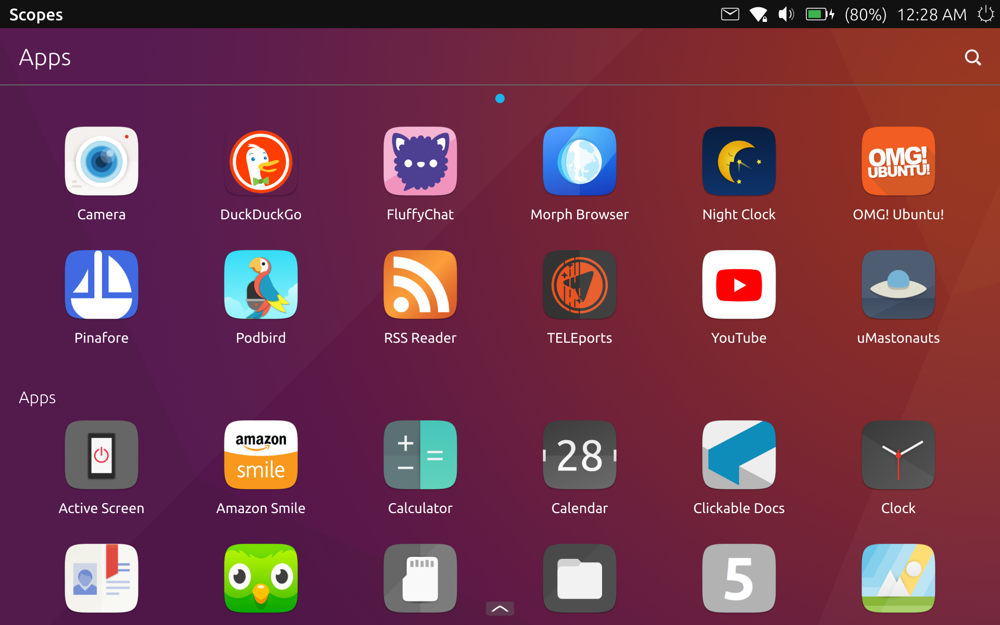
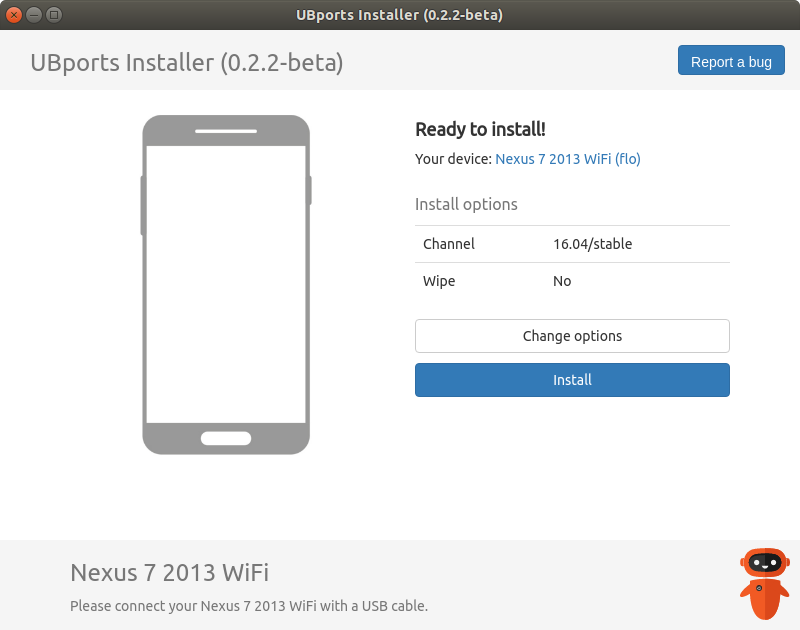

# Nexus 7 2013 (WiFi) and Ubuntu Touch

About a month ago (give or take) I purchased a Nexus 7 2013 (WiFi) with the intent of flashing Ubuntu Touch (OTA 9) onto it. I had previously flashed Ubuntu Touch onto a Nexus 5 that I had gotten for Christmas last year, again with the intent of flashing Ubuntu Touch onto it, so I knew what I could look forward to and what I could expect.

## Flashing Ubuntu Touch
Flashing Ubuntu Touch onto the Nexus 7 was pretty easy overall. First thing I had to do was install `adb` and `fastboot` onto my computer (running Ubuntu), as well as the `ubports-installer` snap.

Next, on the nexus 7 I needed to enable developer mode, enable USB debugging, unlock the bootloader, and re-enable dev mode and USB debugging. After that, I hooked up the Nexus 7 to my PC and launched the UBports Installer. It detected that the Nexus 7 was connected and pulled up the menu for flashing it right away. I clicked the needed buttons to flash it and let it do it's thing.

## Initial Setup
After Ubuntu Touch was flashed onto the Nexus 7, I went through the initial setup of the device. First was the standard stuff like setting up WiFi and creating a user account.

After that, I made sure any updates were applied and went on to install the apps I use from the Open Store, as well as any that I made myself.

## Day-to-Day Usage
Using this thing more-or-less every day for about the past month, it has worked great! I use it to check the weather, browse my Mastodon feed, shop on Amazon, and more!

## Papercuts
Of course, my experience has not been perfect. While I have not had any major issues using Ubuntu Touch on the Nexus 7, here are some papercuts that I have come across:

* Screen orrientaion is locked to landscape on lockscreen
* WiFi may not auto-reconnect. Pulling down WiFi menu may reconnect Wifi. Disabling WiFi and re-enabling reconnects WiFi
* Username on lockscreen does not move when keyboard pulls up

## Summary
All in all, I love this thing! Ubuntu Touch is maturing nicely, and is very much in a usable, daily driver state. The Nexus 7 is a nice tablet, with a good screen resolution, feel, and size.

Of course, you may suffer from a lack of apps compaired to what you may be used to from iOS or Android, however there is a nice selection of apps available on the Open Store that may fill almost any role you need them to.

Overall, I would definitely suggest this setup to anyone wanting a nice tablet with a free OS on it, or simply a nice tablet experience overall!

## Afterword: App Picks
Here are some apps I recommend using on Ubuntu Touch:

* FluffyChat (Matrix Client)
* Podbird (Podcast client)
* Telegram/TELEports* (Telegram)
* uMastonauts (Mastodon client)
* Recorder (audio recorder)
* uAdBlock (system-wide ad blocker)
* UT Tweak Tool (tweak UT even more. Use caution!)

*TELEports is still in beta as of writing

---

 This work is licensed under a <a rel="license" href="http://creativecommons.org/licenses/by-sa/4.0/">Creative Commons Attribution-ShareAlike 4.0 International License</a>.